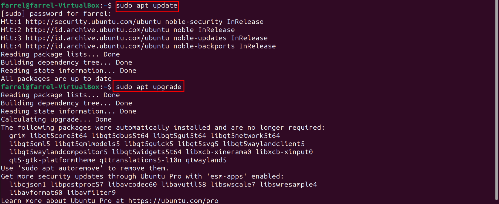
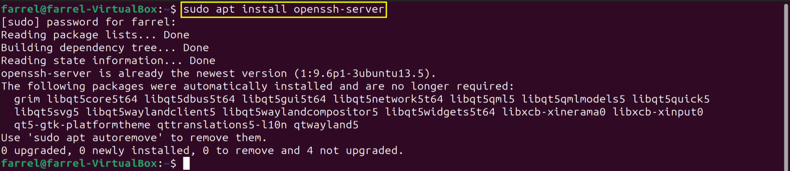
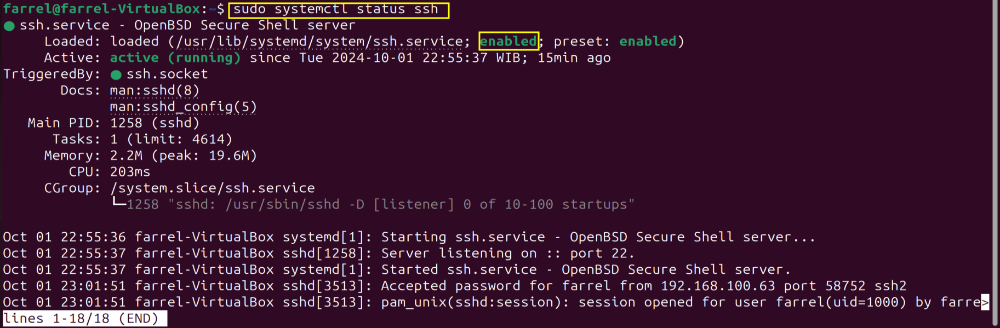
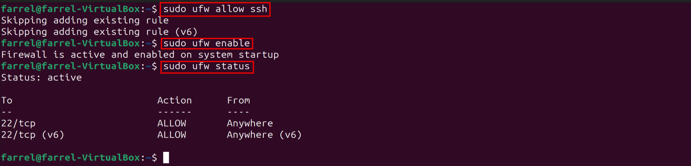
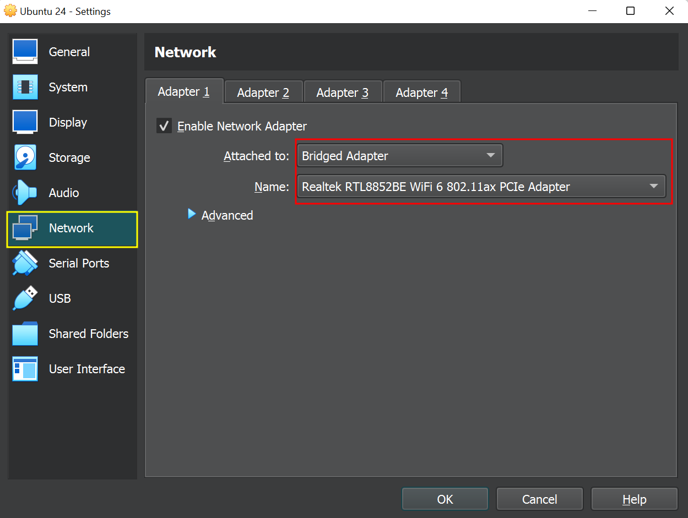
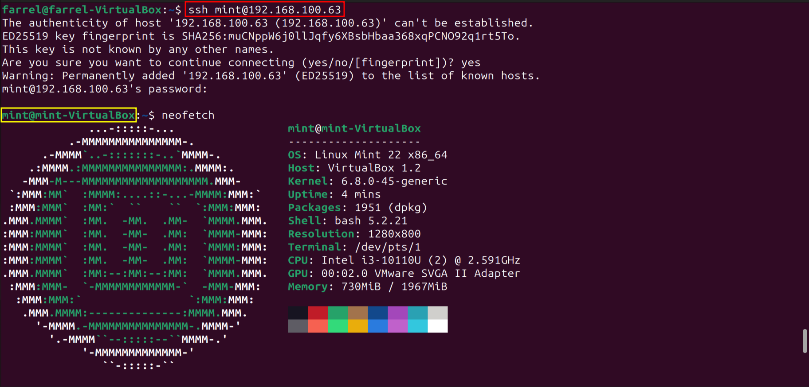
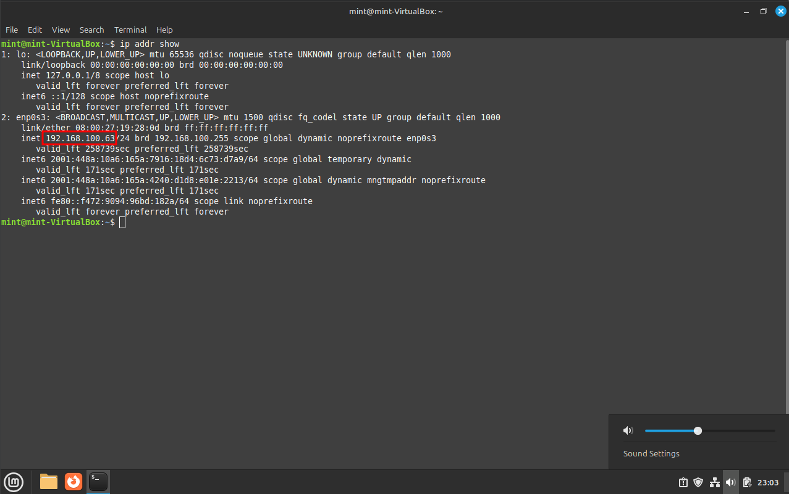

# Ahmad Farrel Aly
# 0911282328045
# SK3C
# Praktikum Sistem Operasi

# Praktikum SSH (Secure Shell)
Merupakan suatu protokol jaringan yang memungkinkan pengguna untuk mengakses dan mengontrol komputer dari jarak jauh.

# Mengendalikan Sistem Operasi Linux Mint dari Linux Ubuntu
1. Memperbarui (Update) packages sebelum instalasi SSH dengan *sudo apt update* dan *sudo apt upgrade* 
###
2. Lakukan Instalasi SSH dengan *sudo apt install openssh-server* 
###
3. Menjalankan service SSH dengan *sudo systemctl enable --now ssh* dan periksa servicenya apakah sudah berjalan dengan *sudo systemctl status ssh*  
###
4. Konfigurasi firewall sebelum menghubungkan ke server dengan *sudo ufw allow ssh* lalu *sudo ufw enable* dan periksa apakah firewall sudah berjalan dengan *sudo ufw status* 
###
4. Kemudian di pengaturan VirtualBox pada bagian network, gunakan bridged adapter dan pilih Wi-Fi card yang ada 
###
6. Lakukan/konfigurasi juga hal yang serupa pada Linux Mint sebelum dihubungkan.
7. Lalu hubungkan server dengan command *ssh user@ipaddress*  
